# Mi Proyecto de Python: Clases y Objetos

## ¿Cómo diseñé mi programa?
Para este proyecto usé la **Programación Orientada a Objetos (POO)**. Básicamente, en lugar de tener un montón de código suelto, creé "moldes" llamados **Clases** para representar cosas de la vida real, como un Libro o una Cuenta de Banco.

* **Clases:** Son los planos del programa (como el plano de una casa).
* **Objetos:** Son las versiones reales de esos planos (como la casa ya construida).
* **Métodos:** Son las acciones que pueden hacer los objetos (prestar, devolver, depositar).
* **Init:** Es lo que prepara al objeto apenas lo creamos para que no tenga errores.

---

## ¿Cómo protegí la información? (Encapsulamiento)
El encapsulamiento es como ponerle una clave a tus datos. No quería que cualquiera pudiera cambiar el saldo de una cuenta o el estado de un libro sin permiso.

Para eso hice lo siguiente:
* **Atributos privados:** Les puse guiones (`_` o `__`) para que nadie los toque desde afuera de la clase.
* **Getters y Setters:** Son como los guardias de seguridad. Permiten ver el dato, pero si alguien lo quiere cambiar, primero se revisa que sea un valor válido (por ejemplo, que no pongan saldos negativos).

---

## Ejemplos de Ejecución (Capturas en Consola)

---

<b>📂 Capturas 01 - 10 (Click para abrir)</b>

 

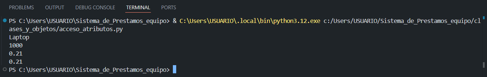
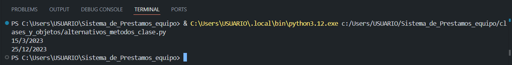
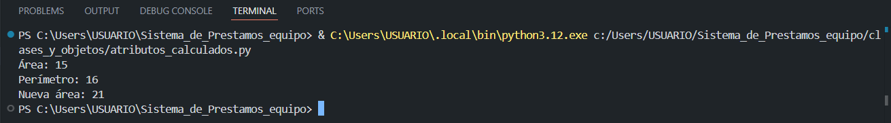
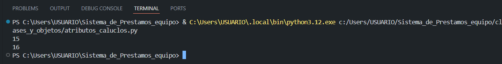
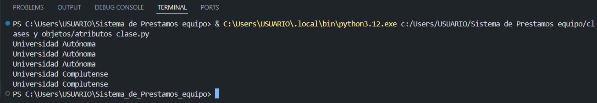
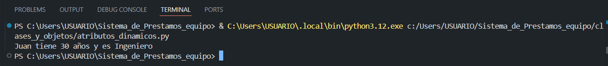
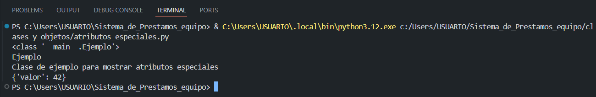
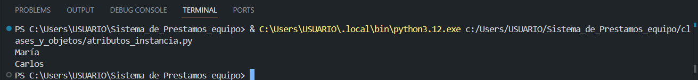
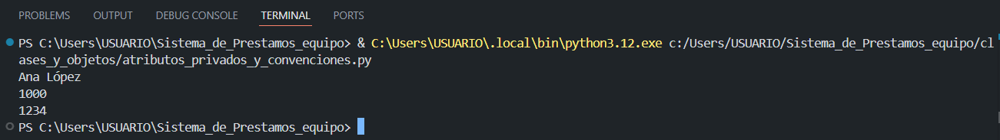
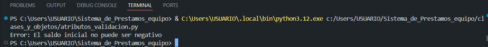

<b>📂 Capturas 11 - 20</b>

 

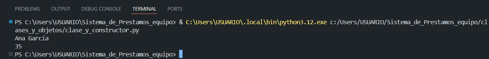
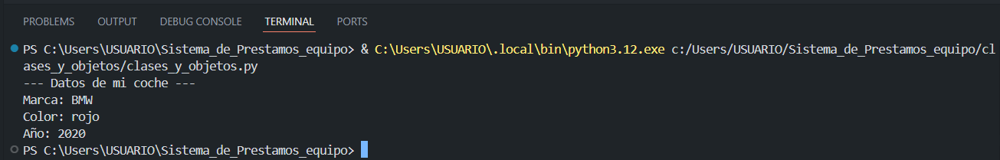
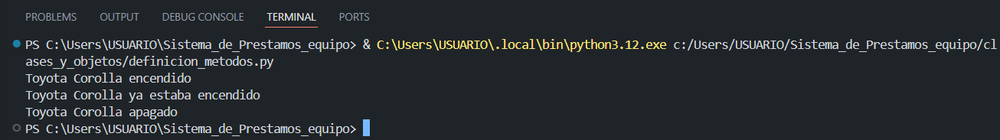
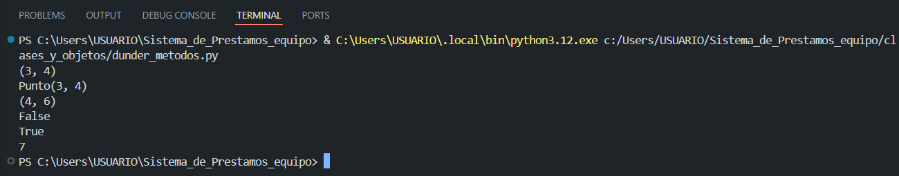
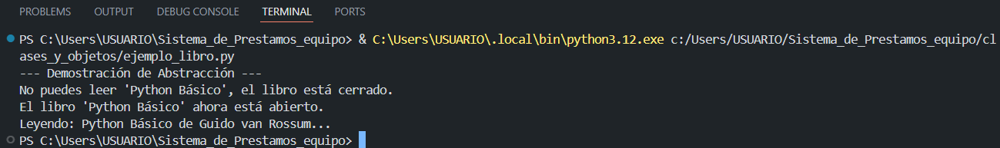
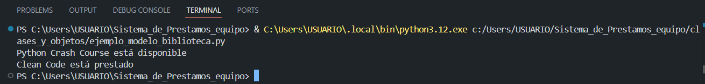
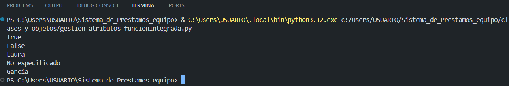
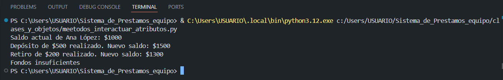
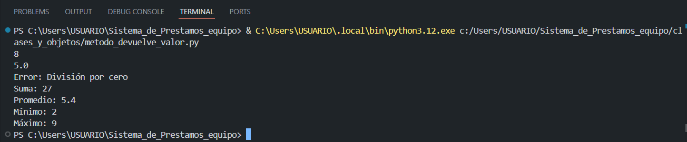
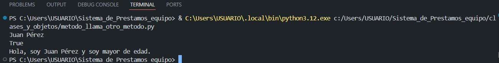

<b>📂 Capturas 21 - 30</b>

 

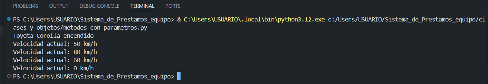
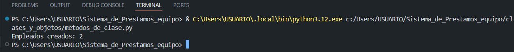
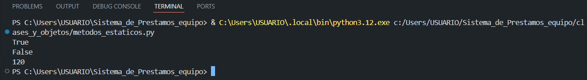
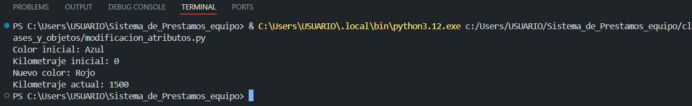
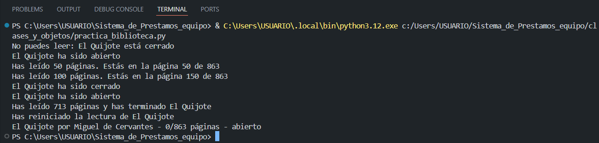
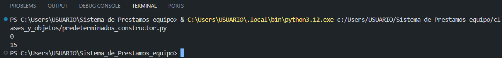
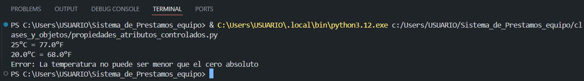
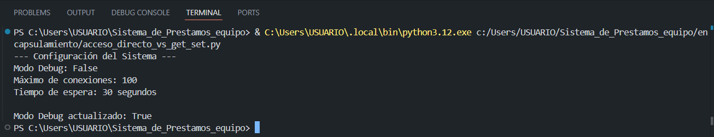
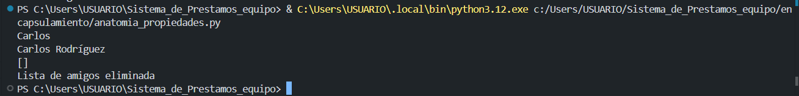
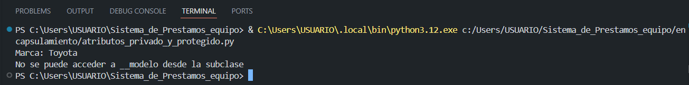

<b>📂 Capturas 31 - 40</b>

 

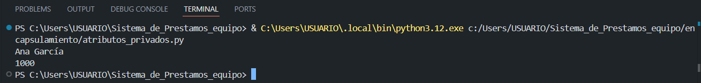
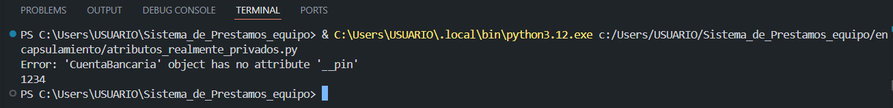
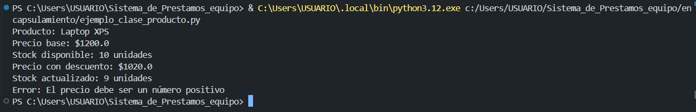
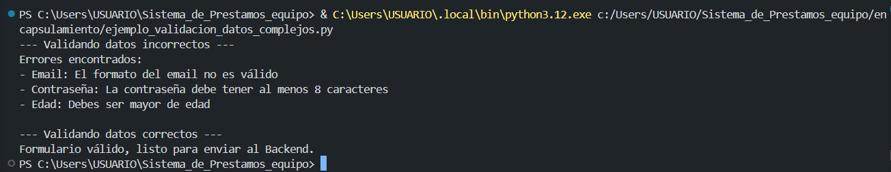
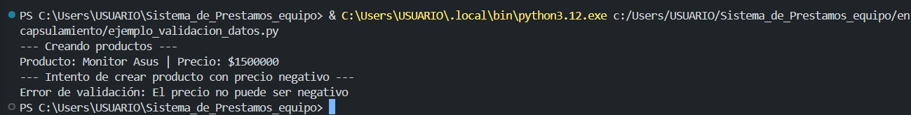
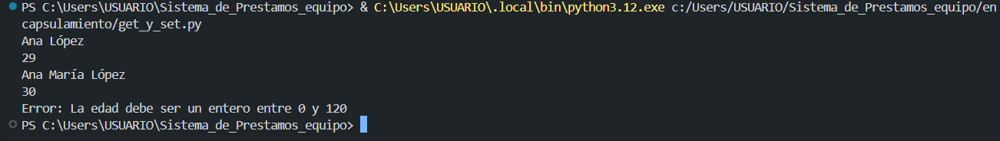
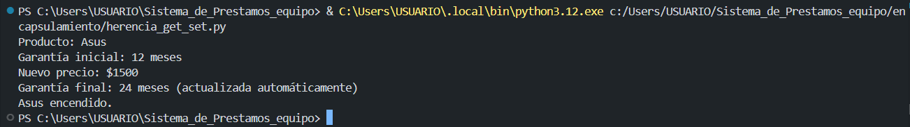
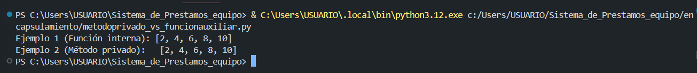
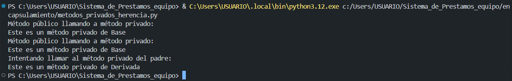
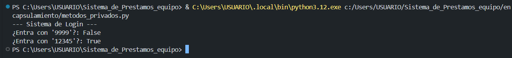

<b>📂 Capturas 41 - 52</b>

 

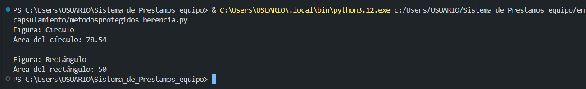
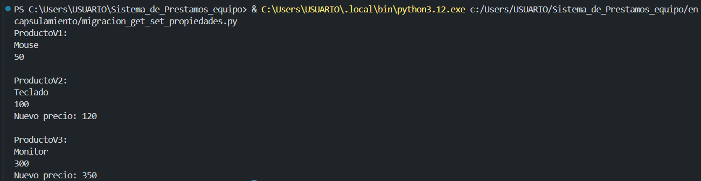
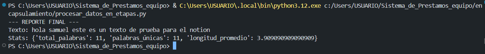
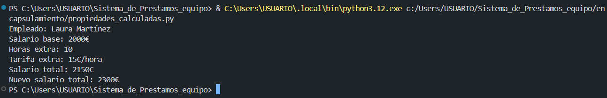
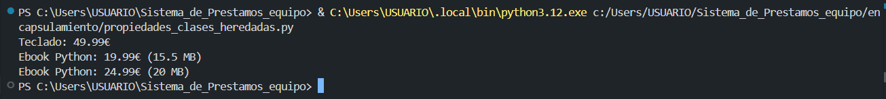
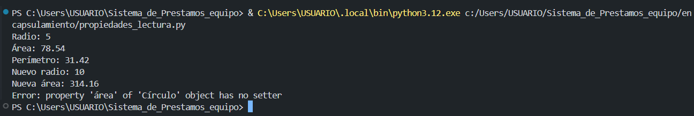
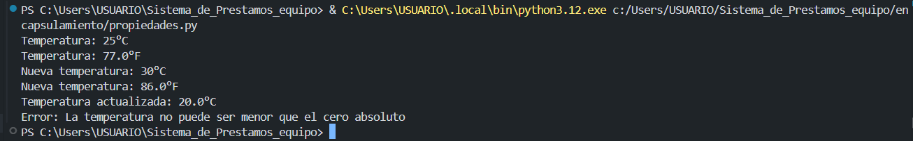
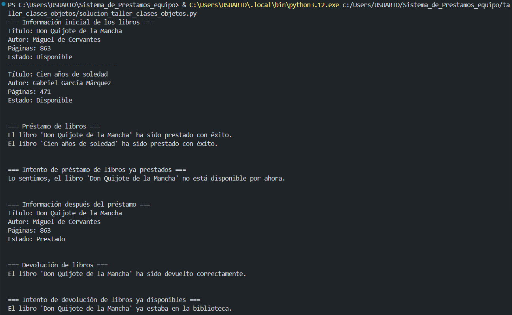
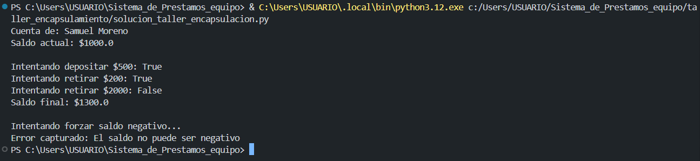
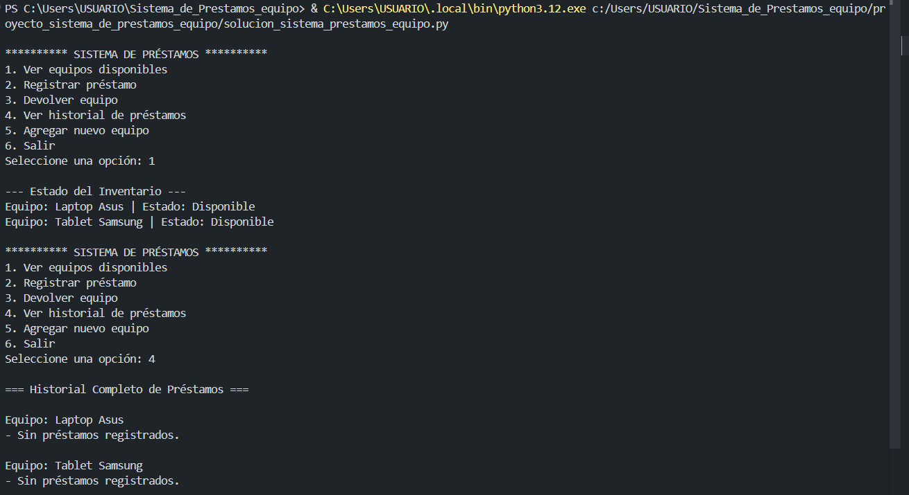

---

## Mi Reflexión Personal
Hacer este proyecto me sirvió para entender que programar con objetos es mucho más ordenado. Al principio me costó un poco entender eso de los métodos privados, pero luego vi que es clave para que el programa no falle si alguien mete un dato mal.

Aprendí a organizar mejor mis ideas y a crear códigos que se pueden volver a usar en otros proyectos. Me gustó ver cómo algo que parece teoría aburrida se vuelve un sistema de préstamos real que funciona bien.